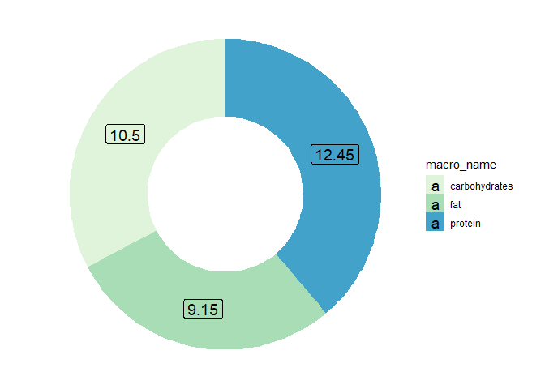

<!-- README.md is generated from README.Rmd. Please edit that file -->

# Future

<!-- badges: start -->

[](https://github.com/FUTUR-TEAM/Future/actions)
[](https://codecov.io/gh/FUTUR-TEAM/Future?branch=main)
<!-- badges: end -->

Future is a tool for creating healthy meals. You can calculate your BMI,
calculate energy value of preparing meal and calculate glycemic index of
this meal.

## Installation

You can install the development version of Future from
[GitHub](https://github.com/) with:

``` r
# install.packages("devtools")
devtools::install_github("FUTUR-TEAM/Future")
```

## Example

By default, Future was prepared as Shiny app, but you can use single
function from command line. This is a basic example which shows you how
to calculate percent of macronutrients of meal from lists of using
products and their weights

``` r
library(Future)
#> Loading required package: shiny
#> Warning: package 'shiny' was built under R version 4.0.4
#> Loading required package: shinydashboard
#> Warning: package 'shinydashboard' was built under R version 4.0.5
#> 
#> Attaching package: 'shinydashboard'
#> The following object is masked from 'package:graphics':
#> 
#>     box

df <- data.frame(products = c("Banan","Kawior"), weight = c(50,50), stringsAsFactors = FALSE) 

macro_df <- macronutrients_of_meal(as.list(df$products), as.list(df$weight))
macro_df
#>      macro_name   sum percent
#> 1       protein 12.45   38.79
#> 2           fat  9.15   28.50
#> 3 carbohydrates 10.50   32.71
macro_percent_graph(macro_df)
```


